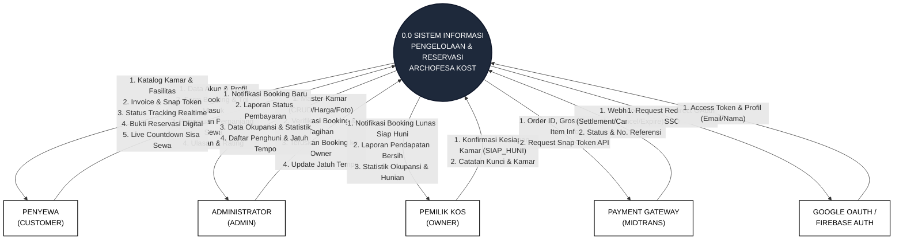
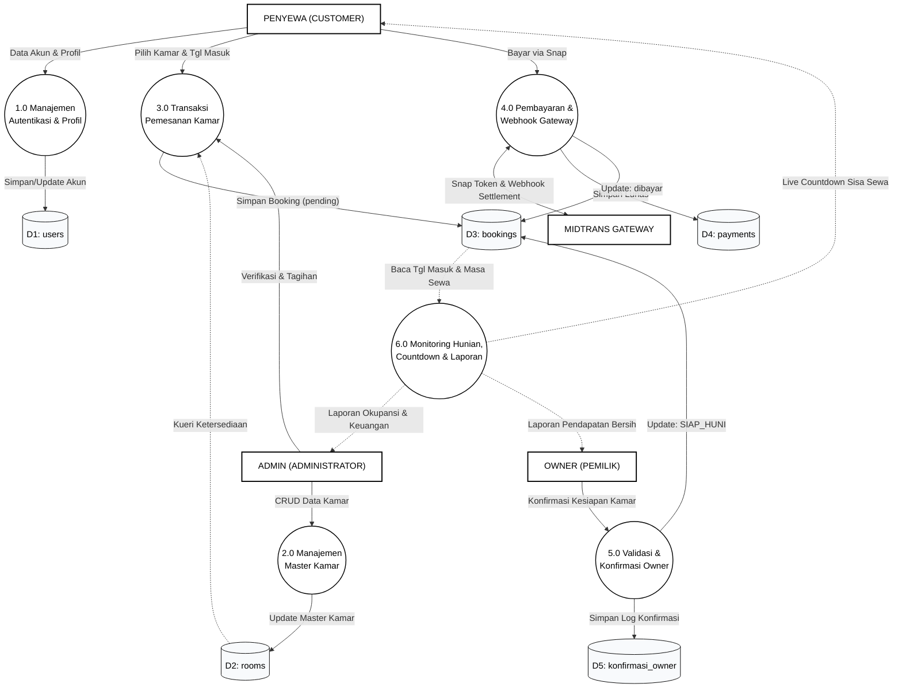
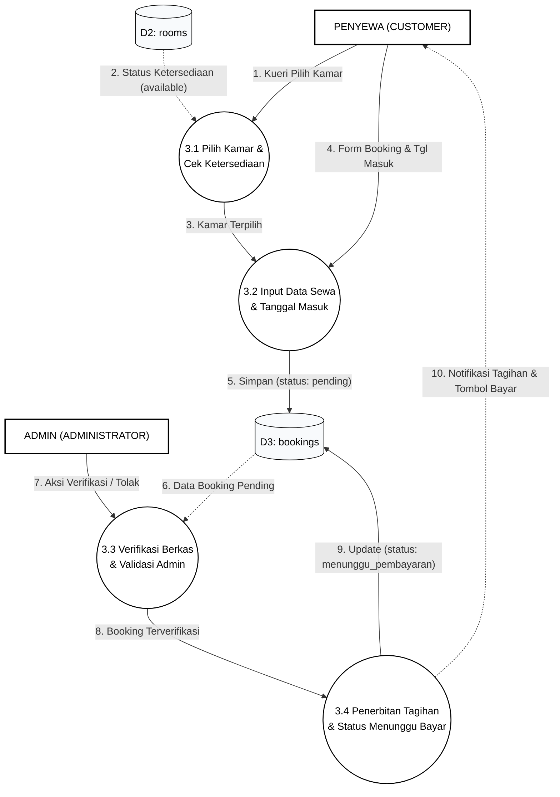
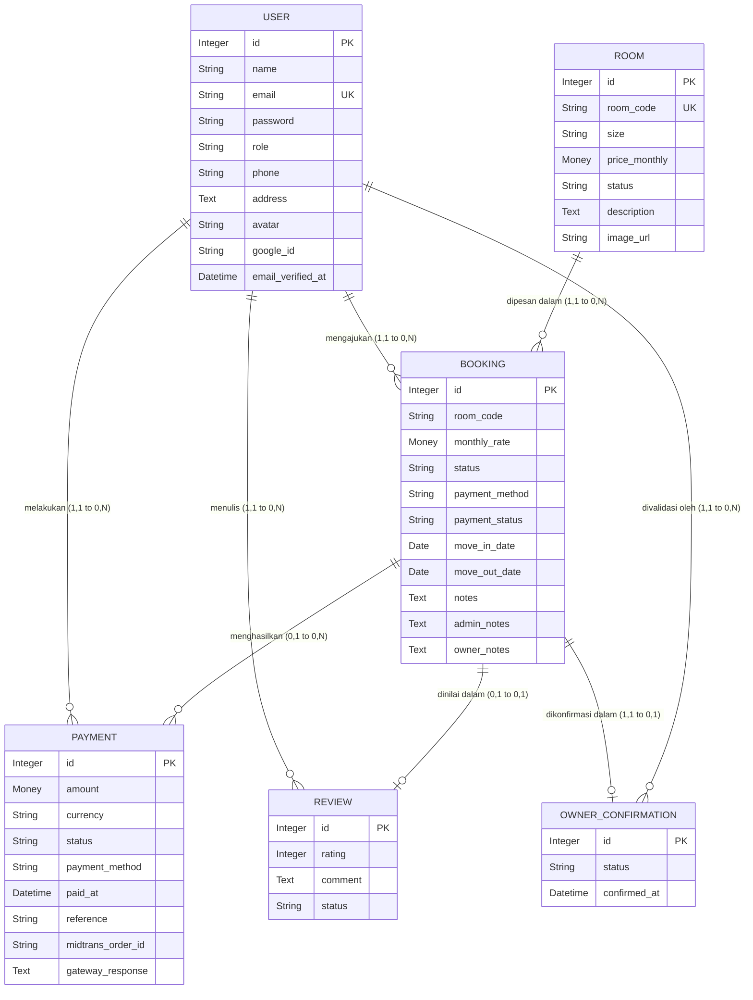
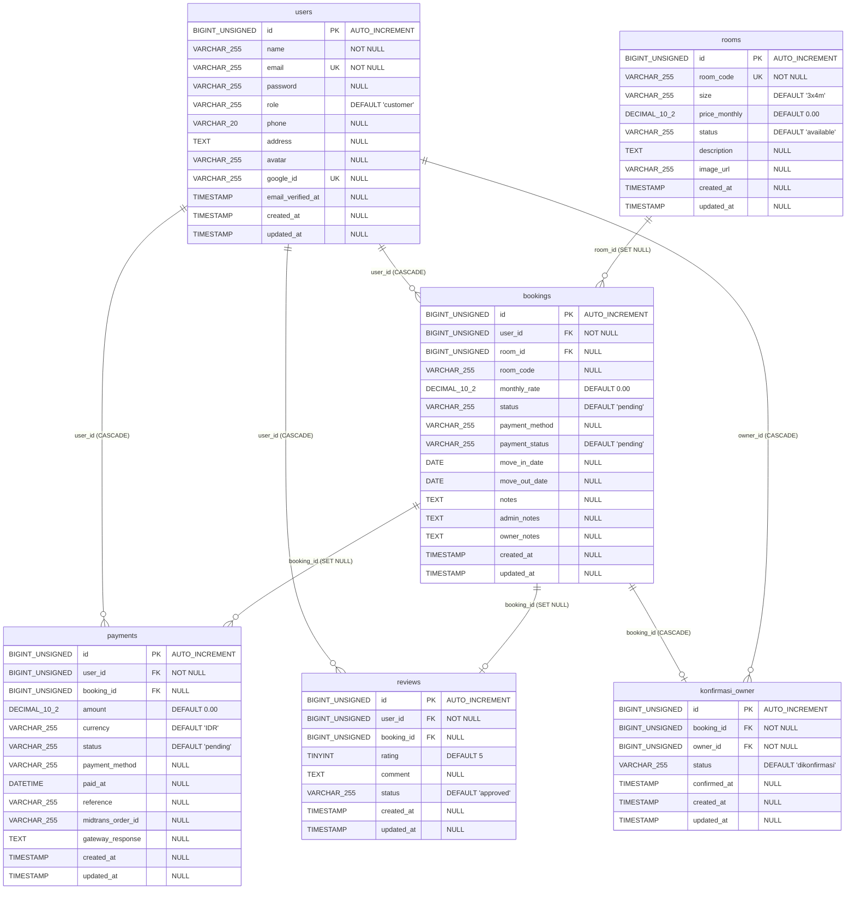

# Dokumentasi Lengkap Diagram Sistem & Perancangan ARCHOFESA KOST

Dokumen ini merupakan panduan perancangan sistem informasi lengkap untuk **ARCHOFESA KOST**, yang mencakup:
1. **DFD Level 0 (*Context Diagram / Diagram Konteks*)**
2. **DFD Level 1 (*Dekomposisi Proses Utama & Data Store*)**
3. **DFD Level 2 (*Dekomposisi Detail Proses 3.0 Transaksi Reservasi*)**
4. **Diagram Kasus Penggunaan (*Use Case Diagram*)**
5. **Diagram Alur Bisnis (*Cross-Functional Swimlane Flowchart*)**
6. **Diagram Status Mesin (*Booking Lifecycle State Machine*)**
7. **Model Data Konseptual (*Conceptual Data Model - CDM*)**
8. **Model Data Fisik (*Physical Data Model - PDM / Relasi Database MySQL*)**

---

## 1. DFD Level 0 (Diagram Konteks / Context Diagram)

Diagram Konteks mendefinisikan batas sistem (*system boundary*) secara menyeluruh, 1 proses sentral `0.0`, dan interaksi dengan 5 entitas eksternal (*terminator*).

---

## 2. DFD Level 1 (Dekomposisi Proses Utama)

DFD Level 1 memecah Proses `0.0` menjadi **6 Sub-Proses Utama** dan menghubungkannya dengan **5 Data Store Database**.

---

## 3. DFD Level 2 (Dekomposisi Proses 3.0 Transaksi Pemesanan)

DFD Level 2 merinci alur transaksi reservasi kamar dari pemilihan kamar, input formulir, validasi admin, hingga penerbitan tagihan.

---

## 4. Model Data Konseptual (*Conceptual Data Model - CDM*)

---

## 5. Model Data Fisik (*Physical Data Model - PDM / MySQL*)

---

## 6. Daftar File XML Draw.io Siap Pakai
- 📄 **[DFD_LEVEL_DIAGRAM.xml](file:///c:/xampp/htdocs/Archofesa/DFD_LEVEL_DIAGRAM.xml)** — Multi-Tab DFD Lengkap:
  - **Tab 1:** DFD Level 0 (Context Diagram)
  - **Tab 2:** DFD Level 1 (6 Sub-Proses Utama & 5 Data Store)
  - **Tab 3:** DFD Level 2 (Dekomposisi Proses 3.0 Reservasi)
- 📄 **[CDM_DIAGRAM.xml](file:///c:/xampp/htdocs/Archofesa/CDM_DIAGRAM.xml)** — Conceptual Data Model (Format Tabel B&W).
- 📄 **[CDM_PDM_DIAGRAM.xml](file:///c:/xampp/htdocs/Archofesa/CDM_PDM_DIAGRAM.xml)** — Multi-Tab CDM & PDM MySQL.
- 📄 **[USE_CASE_DIAGRAM.xml](file:///c:/xampp/htdocs/Archofesa/USE_CASE_DIAGRAM.xml)** — Use Case Diagram.
