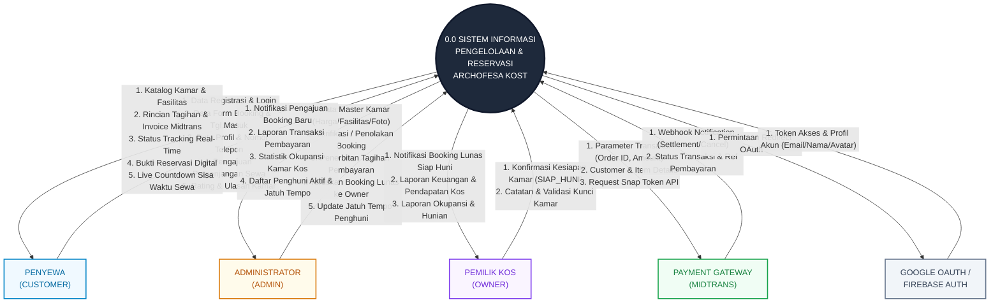
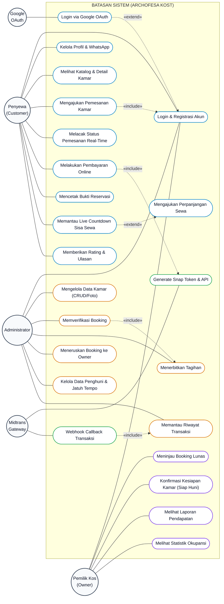
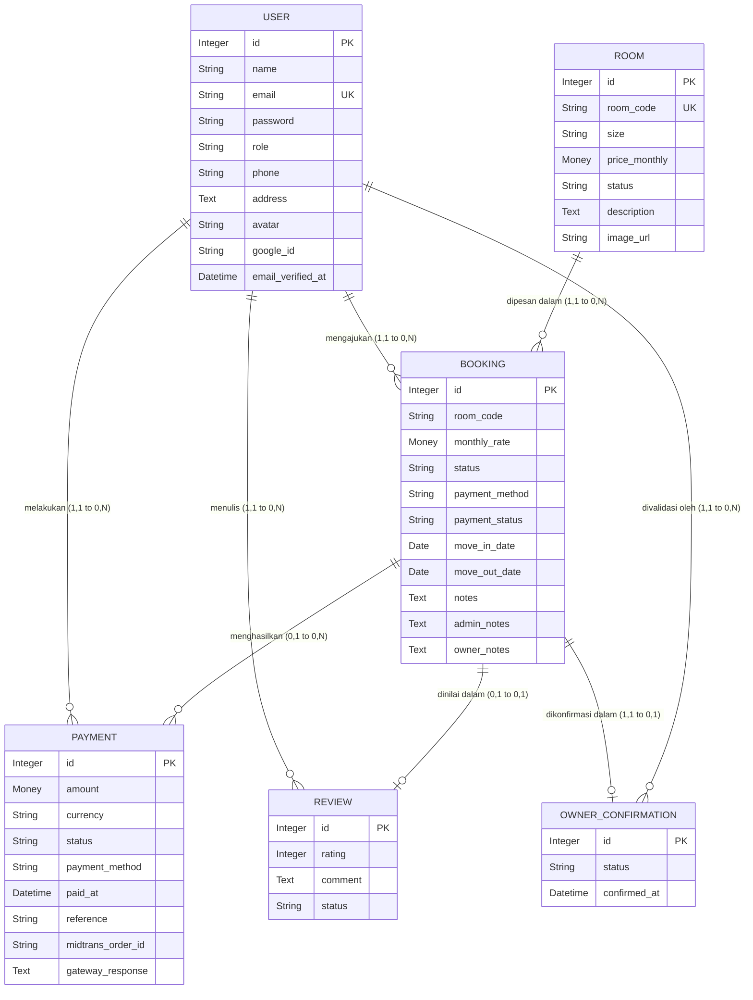
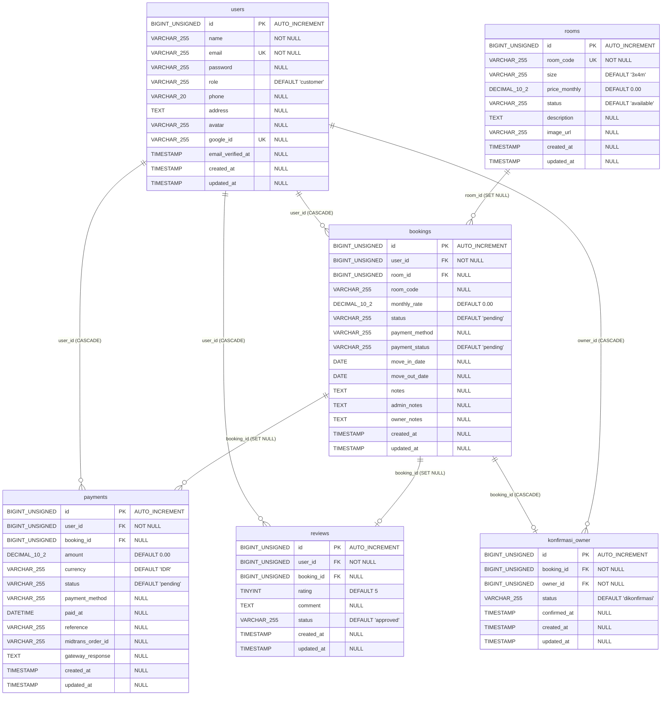

# Dokumentasi Lengkap Diagram Sistem & Perancangan ARCHOFESA KOST

Dokumen ini merupakan panduan perancangan sistem informasi lengkap untuk **ARCHOFESA KOST**, yang mencakup:
1. **Diagram Konteks (*Context Diagram / DFD Level 0*)**
2. **Diagram Kasus Penggunaan (*Use Case Diagram*)**
3. **Diagram Alur Bisnis (*Cross-Functional Swimlane Flowchart*)**
4. **Diagram Status Mesin (*Booking Lifecycle State Machine*)**
5. **Model Data Konseptual (*Conceptual Data Model - CDM*)**
6. **Model Data Fisik (*Physical Data Model - PDM / Relasi Database MySQL*)**

---

## 1. Diagram Konteks (*Context Diagram / DFD Level 0*)

---

## 2. Diagram Kasus Penggunaan (*Use Case Diagram*)

---

## 3. Model Data Konseptual (*Conceptual Data Model - CDM*)

CDM memetakan struktur data logis independen dari DBMS fisik:

---

## 4. Model Data Fisik (*Physical Data Model - PDM / MySQL*)

PDM memetakan skema nyata database MySQL pada Laravel Migration termasuk tipe data presisi, Primary Key (PK), Foreign Key (FK), dan Relasi:

---

## 5. File XML untuk Draw.io
Semua diagram tersedia dalam format XML Draw.io siap pakai:
- 📄 **[CDM_PDM_DIAGRAM.xml](file:///c:/xampp/htdocs/Archofesa/CDM_PDM_DIAGRAM.xml)** — Multi-Tab: Tab 1 (CDM) & Tab 2 (PDM MySQL).
- 📄 **[USE_CASE_DIAGRAM.xml](file:///c:/xampp/htdocs/Archofesa/USE_CASE_DIAGRAM.xml)** — Use Case Diagram Lengkap.
- 📄 **[CONTEXT_DIAGRAM.xml](file:///c:/xampp/htdocs/Archofesa/CONTEXT_DIAGRAM.xml)** — Diagram Konteks (DFD Level 0).
- 📄 **[FLOW_DIAGRAM.xml](file:///c:/xampp/htdocs/Archofesa/FLOW_DIAGRAM.xml)** — Multi-Tab Master Diagram.
